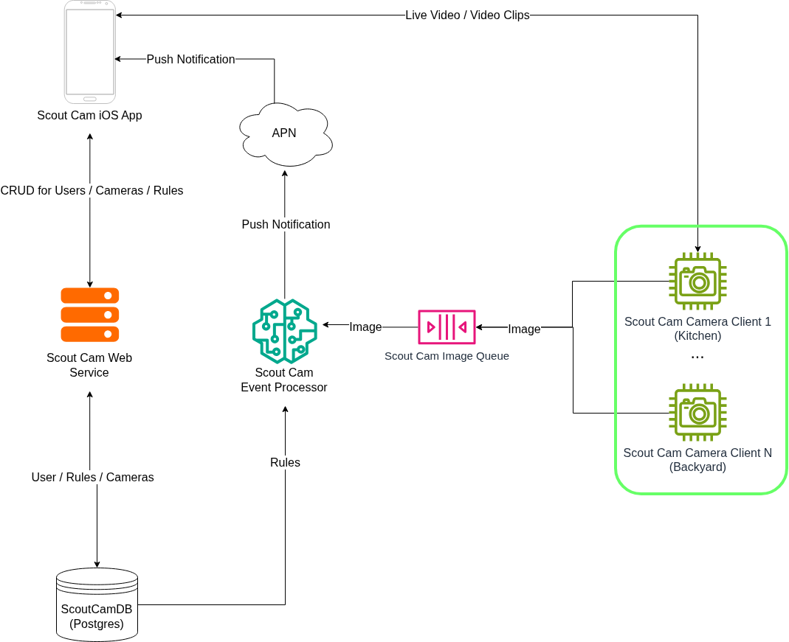

# ScoutCamCameraClient
A camera client designed to run on a Raspberry Pi Zero 2W. The client uses the Raspberry Pi AI camera to 
detect moving objects and sends images to the Scout Cam Event Processor to determine if a user rule should be
triggered.

### System Diagram

[Scout Cam Web Service](https://github.com/ataffe/ScoutCamEventProcessor) - Handles CRUD operations for Users, Cameras, and Rules.

[Scout Cam Event Processor](https://github.com/ataffe/GuardianCamCameraClient) - Processes images received from cameras and send users a push notification if the 
image matches one or more of the users rules.